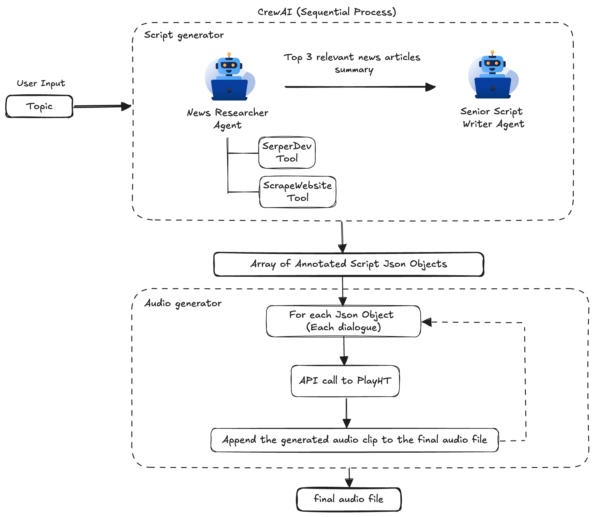

# Podcast Audio Generator

This web application generates a realistic interactive podcast conversation between an interviewer and an interviewee, using the latest news on a given topic.

## Live Demo
Check out the live version of the app [here](https://podcastaudiogenerator.onrender.com/).

## Technology Stack

### Frontend:
- **React.js** for UI components
- **Framer Motion** for animations
- **Tailwind CSS** for styling

### Backend:
- **Python** and **FastAPI** for the API
- **CrewAI** for generating conversations
- **LangChain** for language model orchestration
- **Resend** for email notifications when out of PlayHT credits

## Features
- Generates podcasts based on real-time news topics.
- Interactive UI for inputting topics and playing back the generated podcast.
- Backend integration to handle conversation generation.

## Demo Video
[Watch the Demo](demo.mp4)

## Backend Architecture


## How to Run Locally

### Prerequisites
- Install [Node.js](https://nodejs.org/en/) (v14 or newer).
- Install Python (v3.8 or higher).
- Set up [FastAPI](https://fastapi.tiangolo.com/).

### Installation

1. **Clone the repository:**
   ```bash
   git clone https://github.com/your-repo/podcast-audio-generator.git
   cd podcast-audio-generator
   ```

2. **Frontend Setup:**
   ```bash
   cd front_end
   npm install
   npm start
   ```

3. **Backend Setup:**
   ```bash
   cd back_end
   pip install -r requirements.txt
   uvicorn main:app --reload
   ```

### Usage
- Navigate to `http://localhost:3000` to access the frontend.
- The backend will be available at `http://localhost:8000`.

## License
MIT License